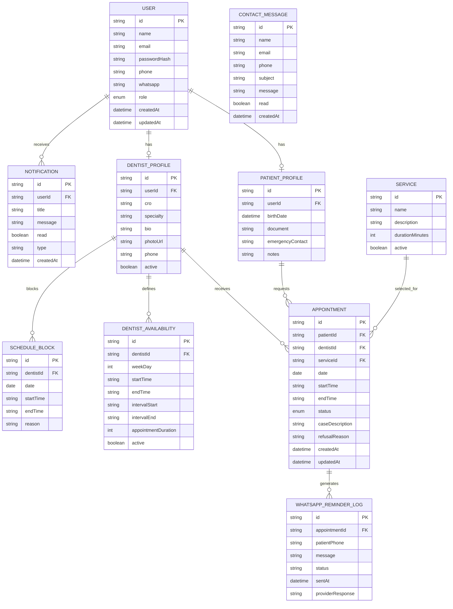
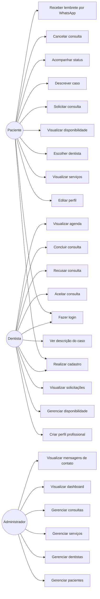

Você será responsável por criar um projeto completo, profissional e funcional do zero para o site/sistema da Clínica Odontológica Nova Previne.

O projeto deve ser tratado como um sistema real para uma clínica odontológica moderna, com foco em apresentação institucional, captação de pacientes, agendamento de consultas, área do paciente, área do dentista e painel administrativo básico.

A identidade visual deve ser inspirada nas artes de divulgação já criadas para a clínica Nova Previne: visual moderno, limpo, profissional, odontológico, com predominância das cores azul, verde e branco, sensação de confiança, saúde, cuidado, tecnologia e acolhimento. Use a logo da Nova Previne como referência visual principal. O site deve ter aparência de clínica odontológica premium, com design responsivo, moderno e bem acabado.

---

# 1. Objetivo geral do projeto

Criar uma plataforma web completa para a Clínica Odontológica Nova Previne, permitindo:

* Apresentar a clínica de forma profissional.
* Divulgar serviços odontológicos.
* Permitir cadastro e login de pacientes.
* Permitir cadastro e login de dentistas.
* Permitir que pacientes solicitem/agendem consultas.
* Permitir que pacientes escolham o dentista desejado.
* Permitir que pacientes visualizem a disponibilidade dos dentistas.
* Permitir que pacientes descrevam previamente seu caso antes da consulta.
* Permitir que dentistas visualizem as solicitações de consulta recebidas.
* Permitir que dentistas aceitem, recusem ou atualizem o status de consultas.
* Permitir envio de lembretes de consulta por WhatsApp.
* Permitir gerenciamento básico de perfis, horários, especialidades e histórico de consultas.
* Ter uma estrutura profissional, escalável e organizada, semelhante a um sistema real de saúde.

A ideia do fluxo é parecida com um sistema de prestação de serviço: o paciente envia uma solicitação/agendamento de consulta, escolhe o dentista e informa o caso. O dentista recebe essa solicitação e pode aceitar, recusar ou acompanhar a consulta.

---

# 2. Stack tecnológica obrigatória

Use uma stack moderna, profissional e bem organizada.

## Frontend

Utilizar:

* Next.js
* React
* TypeScript
* Tailwind CSS
* Bootstrap ou componentes equivalentes quando fizer sentido
* Responsividade completa para desktop, tablet e mobile
* Componentização organizada
* Design system simples com cores, fontes, botões, cards, inputs e espaçamentos padronizados
* Ícones modernos, preferencialmente usando Lucide React ou React Icons
* Animações suaves, se fizer sentido, usando Framer Motion
* Validação de formulários com React Hook Form + Zod
* Consumo de API com Axios ou Fetch organizado

## Backend

Pode ser feito de uma das seguintes formas:

Opção preferencial:

* API Routes do Next.js ou backend separado em Node.js com NestJS/Express

Utilizar:

* Node.js
* TypeScript
* Prisma ORM
* PostgreSQL
* JWT ou NextAuth/Auth.js para autenticação
* Bcrypt para hash de senha
* Validação com Zod
* Estrutura de services/repositories/controllers, caso use backend separado
* Middlewares de autenticação e autorização
* Controle de permissões por tipo de usuário: paciente, dentista e administrador

## Banco de Dados

Utilizar:

* PostgreSQL
* Prisma ORM
* Migrations organizadas
* Seeds com dados de exemplo

## DevOps / Ambiente

Utilizar:

* Docker
* Docker Compose
* Variáveis de ambiente com `.env.example`
* Scripts no `package.json`
* README completo explicando como rodar o projeto
* Estrutura preparada para deploy futuro
* ESLint
* Prettier
* Padronização de commits
* Git organizado

---

# 3. Identidade visual e frontend

O frontend deve ser moderno, responsivo e com aparência profissional.

## Paleta de cores sugerida

Use como base:

* Azul principal: relacionado à odontologia, confiança e tecnologia.
* Verde principal: relacionado à saúde, cuidado e bem-estar.
* Branco: limpeza, leveza e ambiente clínico.
* Azul escuro: para títulos e contraste.
* Tons claros de azul e verde: para fundos suaves, cards e seções.

Sugestão aproximada:

* Primary Blue: `#008FD3`
* Dark Blue: `#003B6F`
* Primary Green: `#009E5A`
* Light Blue: `#EAF7FC`
* Light Green: `#EAF8F1`
* White: `#FFFFFF`
* Gray Text: `#4B5563`

## Estilo visual

O site deve ter:

* Layout limpo e moderno.
* Hero section impactante.
* Elementos arredondados.
* Cards com sombra suave.
* Ícones odontológicos.
* Botões bem destacados.
* Imagens ou ilustrações relacionadas à odontologia.
* Seções bem espaçadas.
* Hierarquia visual clara.
* Aparência confiável, acolhedora e profissional.

## Páginas públicas

Criar as seguintes páginas públicas:

### Home

Deve conter:

* Header com logo, navegação e botões de login/cadastro.
* Hero section com chamada principal.
* Chamada sugerida:
  “Cuidando do seu sorriso com confiança há 20 anos”
* Botão principal: “Agendar consulta”
* Botão secundário: “Conhecer tratamentos”
* Destaque para os 20 anos da Nova Previne.
* Seção de serviços.
* Seção de diferenciais da clínica.
* Seção de dentistas em destaque.
* Seção de depoimentos.
* Seção de chamada para WhatsApp.
* Footer completo.

### Sobre a Clínica

Deve conter:

* História da Nova Previne.
* Destaque para os 20 anos.
* Missão, visão e valores.
* Estrutura da clínica.
* Compromisso com atendimento humanizado.

### Tratamentos / Serviços

Criar página listando serviços odontológicos, como:

* Ortodontia
* Clareamento dental
* Limpeza e prevenção
* Implantes
* Prótese dentária
* Endodontia
* Odontopediatria
* Periodontia
* Estética dental
* Avaliação odontológica

Cada serviço deve ter card com descrição, ícone e botão para agendar.

### Dentistas

Página pública listando os dentistas cadastrados/ativos.

Cada dentista deve ter:

* Foto ou avatar
* Nome
* CRO
* Especialidade
* Descrição profissional
* Horários disponíveis resumidos
* Botão para agendar com esse dentista

### Contato

Deve conter:

* Formulário de contato
* WhatsApp
* Telefone
* Endereço
* Mapa incorporado, se possível
* Horário de funcionamento
* Redes sociais

### Login e Cadastro

Criar telas de:

* Login
* Cadastro de paciente
* Cadastro de dentista
* Recuperação de senha, se possível

---

# 4. Tipos de usuários

O sistema deve ter pelo menos três tipos de usuários:

## Paciente

O paciente pode:

* Criar conta.
* Fazer login.
* Editar perfil.
* Informar nome, e-mail, telefone/WhatsApp, data de nascimento e informações básicas.
* Marcar consulta.
* Escolher dentista.
* Escolher serviço/tratamento.
* Ver disponibilidade do dentista.
* Descrever previamente seu caso.
* Anexar observações ou informações relevantes.
* Visualizar suas consultas.
* Cancelar consulta, respeitando regra de antecedência.
* Receber lembrete por WhatsApp.
* Ver status da consulta.
* Ver histórico de consultas.

## Dentista

O dentista pode:

* Criar conta.
* Fazer login.
* Criar e editar perfil profissional.
* Informar nome, CRO, especialidade, bio, telefone, foto e horários de atendimento.
* Gerenciar sua disponibilidade.
* Visualizar consultas solicitadas.
* Ver a prévia do caso enviada pelo paciente.
* Aceitar ou recusar consulta.
* Informar motivo da recusa, quando necessário.
* Atualizar status da consulta.
* Visualizar agenda.
* Ver histórico de atendimentos.
* Visualizar dados básicos do paciente necessários para atendimento.

## Administrador

O administrador pode:

* Fazer login.
* Visualizar dashboard geral.
* Gerenciar pacientes.
* Gerenciar dentistas.
* Gerenciar serviços.
* Gerenciar consultas.
* Ativar ou desativar dentistas.
* Visualizar métricas básicas.
* Configurar horários gerais da clínica.
* Gerenciar mensagens e contatos recebidos.

---

# 5. Funcionalidades principais

## Autenticação

Implementar:

* Cadastro de paciente.
* Cadastro de dentista.
* Login.
* Logout.
* Sessão segura.
* Proteção de rotas.
* Redirecionamento por tipo de usuário.
* Senhas com hash usando bcrypt.
* JWT/Auth.js/NextAuth, conforme arquitetura escolhida.

## Perfil do paciente

O paciente deve poder:

* Ver seus dados.
* Editar nome, telefone, WhatsApp, e-mail e dados básicos.
* Visualizar suas consultas.
* Ver status das consultas:

  * Solicitada
  * Confirmada
  * Recusada
  * Cancelada
  * Concluída
* Ver histórico de consultas.

## Perfil do dentista

O dentista deve poder:

* Editar dados profissionais.
* Cadastrar especialidades.
* Cadastrar CRO.
* Definir horários disponíveis.
* Definir dias de atendimento.
* Ver solicitações de consulta.
* Aceitar, recusar ou concluir consultas.
* Visualizar prévia do caso do paciente.

## Agendamento de consulta

Fluxo esperado:

1. Paciente acessa a página de agendamento.
2. Escolhe o serviço/tratamento.
3. Escolhe o dentista.
4. Visualiza os horários disponíveis.
5. Escolhe data e horário.
6. Descreve brevemente seu caso.
7. Confirma a solicitação.
8. O sistema cria a consulta com status “Solicitada”.
9. O dentista visualiza a solicitação.
10. O dentista aceita ou recusa.
11. Se aceitar, a consulta fica “Confirmada”.
12. Se recusar, deve informar motivo.
13. O paciente consegue acompanhar o status.

## Disponibilidade do dentista

Implementar uma estrutura para que o dentista cadastre:

* Dias da semana disponíveis.
* Horários de início e fim.
* Intervalos.
* Duração média da consulta.
* Bloqueios de horários específicos.

O paciente deve conseguir visualizar apenas horários disponíveis.

## Lembretes por WhatsApp

Implementar uma base preparada para lembretes por WhatsApp.

Pode usar integração simulada inicialmente, com estrutura pronta para integração real com:

* WhatsApp Business API
* Twilio
* Z-API
* Evolution API
* Meta WhatsApp Cloud API

Criar service responsável por envio de mensagens.

Mesmo que não envie de verdade, deixar bem estruturado:

* `sendWhatsAppReminder()`
* templates de mensagem
* logs de envio
* campo para salvar se lembrete foi enviado ou não

Exemplo de mensagem:

“Olá, [nome do paciente]! Este é um lembrete da Clínica Nova Previne. Sua consulta com Dr(a). [nome] está marcada para [data] às [hora]. Esperamos você!”

## Notificações

Implementar notificações internas no sistema:

* Consulta solicitada.
* Consulta confirmada.
* Consulta recusada.
* Consulta cancelada.
* Lembrete enviado.
* Nova mensagem de contato.

## Dashboard do paciente

Exibir:

* Próxima consulta.
* Status das consultas.
* Histórico.
* Botão para novo agendamento.
* Dados do perfil.

## Dashboard do dentista

Exibir:

* Consultas do dia.
* Solicitações pendentes.
* Consultas confirmadas.
* Histórico.
* Agenda semanal.
* Ações rápidas.

## Dashboard administrativo

Exibir:

* Total de pacientes.
* Total de dentistas.
* Total de consultas.
* Consultas pendentes.
* Consultas confirmadas.
* Serviços cadastrados.
* Contatos recebidos.

---

# 6. Requisitos de usuário

## Paciente

RU01 - Como paciente, quero criar uma conta para acessar os recursos da clínica.

RU02 - Como paciente, quero fazer login para visualizar minhas consultas.

RU03 - Como paciente, quero editar meu perfil para manter meus dados atualizados.

RU04 - Como paciente, quero informar meu WhatsApp para receber lembretes de consulta.

RU05 - Como paciente, quero visualizar os tratamentos disponíveis para escolher o serviço desejado.

RU06 - Como paciente, quero escolher um dentista para marcar minha consulta.

RU07 - Como paciente, quero visualizar os horários disponíveis do dentista para escolher o melhor horário.

RU08 - Como paciente, quero descrever previamente meu caso para que o dentista entenda minha necessidade antes da consulta.

RU09 - Como paciente, quero solicitar uma consulta para atendimento odontológico.

RU10 - Como paciente, quero acompanhar o status da minha consulta.

RU11 - Como paciente, quero cancelar uma consulta, caso necessário.

RU12 - Como paciente, quero visualizar meu histórico de consultas.

RU13 - Como paciente, quero receber lembretes de consulta por WhatsApp.

RU14 - Como paciente, quero acessar um canal rápido de contato com a clínica.

## Dentista

RU15 - Como dentista, quero criar uma conta profissional para atender pacientes pela plataforma.

RU16 - Como dentista, quero editar meu perfil profissional para apresentar minhas informações aos pacientes.

RU17 - Como dentista, quero cadastrar minha especialidade e CRO para dar credibilidade ao meu perfil.

RU18 - Como dentista, quero definir meus horários disponíveis para receber agendamentos.

RU19 - Como dentista, quero visualizar solicitações de consulta para decidir se posso atender.

RU20 - Como dentista, quero ver a descrição prévia do caso do paciente para me preparar para a consulta.

RU21 - Como dentista, quero aceitar consultas para confirmar o atendimento.

RU22 - Como dentista, quero recusar consultas informando o motivo.

RU23 - Como dentista, quero visualizar minha agenda diária e semanal.

RU24 - Como dentista, quero concluir consultas atendidas para manter o histórico atualizado.

## Administrador

RU25 - Como administrador, quero visualizar um dashboard geral da clínica.

RU26 - Como administrador, quero gerenciar pacientes cadastrados.

RU27 - Como administrador, quero gerenciar dentistas cadastrados.

RU28 - Como administrador, quero gerenciar serviços odontológicos.

RU29 - Como administrador, quero gerenciar consultas.

RU30 - Como administrador, quero visualizar mensagens de contato recebidas.

RU31 - Como administrador, quero ativar ou desativar dentistas.

RU32 - Como administrador, quero acompanhar métricas básicas do sistema.

---

# 7. Requisitos do sistema

RS01 - O sistema deve permitir cadastro de usuários com perfis diferentes: paciente, dentista e administrador.

RS02 - O sistema deve autenticar usuários de forma segura.

RS03 - O sistema deve armazenar senhas usando hash com bcrypt.

RS04 - O sistema deve proteger rotas conforme o tipo de usuário.

RS05 - O sistema deve permitir que pacientes criem solicitações de consulta.

RS06 - O sistema deve permitir que pacientes escolham serviço, dentista, data e horário.

RS07 - O sistema deve validar se o horário escolhido está disponível.

RS08 - O sistema deve impedir agendamentos duplicados para o mesmo dentista, data e horário.

RS09 - O sistema deve permitir que dentistas aceitem ou recusem consultas.

RS10 - O sistema deve permitir que dentistas informem motivo da recusa.

RS11 - O sistema deve atualizar automaticamente o status da consulta.

RS12 - O sistema deve armazenar o histórico de consultas.

RS13 - O sistema deve permitir cadastro e edição de disponibilidade dos dentistas.

RS14 - O sistema deve permitir cadastro de serviços odontológicos.

RS15 - O sistema deve permitir envio ou simulação de lembretes por WhatsApp.

RS16 - O sistema deve armazenar logs de lembretes enviados.

RS17 - O sistema deve gerar notificações internas para pacientes, dentistas e administradores.

RS18 - O sistema deve ter layout responsivo para desktop, tablet e celular.

RS19 - O sistema deve usar banco PostgreSQL.

RS20 - O sistema deve usar Docker e Docker Compose para facilitar execução.

RS21 - O sistema deve ter documentação completa no README.

RS22 - O sistema deve ter dados iniciais de exemplo via seed.

RS23 - O sistema deve possuir validação de formulários no frontend e backend.

RS24 - O sistema deve tratar erros de forma amigável.

RS25 - O sistema deve ter estrutura organizada, escalável e limpa.

---

# 8. Modelo de banco de dados sugerido

Criar as entidades principais:

## User

Campos sugeridos:

* id
* name
* email
* passwordHash
* phone
* whatsapp
* role
* createdAt
* updatedAt

Roles:

* PATIENT
* DENTIST
* ADMIN

## PatientProfile

Campos sugeridos:

* id
* userId
* birthDate
* document
* emergencyContact
* notes

## DentistProfile

Campos sugeridos:

* id
* userId
* cro
* specialty
* bio
* photoUrl
* phone
* active
* createdAt
* updatedAt

## Service

Campos sugeridos:

* id
* name
* description
* durationMinutes
* active
* createdAt
* updatedAt

## DentistAvailability

Campos sugeridos:

* id
* dentistId
* weekDay
* startTime
* endTime
* intervalStart
* intervalEnd
* appointmentDuration
* active

## ScheduleBlock

Campos sugeridos:

* id
* dentistId
* date
* startTime
* endTime
* reason

## Appointment

Campos sugeridos:

* id
* patientId
* dentistId
* serviceId
* date
* startTime
* endTime
* status
* caseDescription
* refusalReason
* createdAt
* updatedAt

Status possíveis:

* REQUESTED
* CONFIRMED
* REFUSED
* CANCELLED
* COMPLETED

## Notification

Campos sugeridos:

* id
* userId
* title
* message
* read
* type
* createdAt

## WhatsAppReminderLog

Campos sugeridos:

* id
* appointmentId
* patientPhone
* message
* status
* sentAt
* providerResponse

## ContactMessage

Campos sugeridos:

* id
* name
* email
* phone
* subject
* message
* createdAt
* read

---

# 9. Diagrama ER em Mermaid

Inclua esse diagrama no README:



---

# 10. Diagrama de casos de uso em Mermaid

Inclua esse diagrama no README:



---

# 11. Estrutura sugerida do projeto

Use uma estrutura limpa. Exemplo com Next.js fullstack:

```txt
nova-previne/
├── docker-compose.yml
├── Dockerfile
├── README.md
├── .env.example
├── package.json
├── prisma/
│   ├── schema.prisma
│   ├── migrations/
│   └── seed.ts
├── public/
│   ├── logo.png
│   └── images/
├── src/
│   ├── app/
│   │   ├── page.tsx
│   │   ├── sobre/
│   │   ├── tratamentos/
│   │   ├── dentistas/
│   │   ├── contato/
│   │   ├── login/
│   │   ├── cadastro/
│   │   ├── dashboard/
│   │   │   ├── paciente/
│   │   │   ├── dentista/
│   │   │   └── admin/
│   │   └── api/
│   │       ├── auth/
│   │       ├── users/
│   │       ├── dentists/
│   │       ├── services/
│   │       ├── appointments/
│   │       ├── availability/
│   │       ├── notifications/
│   │       ├── reminders/
│   │       └── contact/
│   ├── components/
│   │   ├── layout/
│   │   ├── ui/
│   │   ├── forms/
│   │   ├── cards/
│   │   └── sections/
│   ├── lib/
│   │   ├── prisma.ts
│   │   ├── auth.ts
│   │   ├── validations.ts
│   │   └── utils.ts
│   ├── services/
│   │   ├── appointmentService.ts
│   │   ├── availabilityService.ts
│   │   ├── notificationService.ts
│   │   └── whatsappService.ts
│   ├── styles/
│   └── types/
```

---

# 12. Rotas principais da aplicação

## Rotas públicas

* `/`
* `/sobre`
* `/tratamentos`
* `/dentistas`
* `/contato`
* `/login`
* `/cadastro`
* `/cadastro/paciente`
* `/cadastro/dentista`

## Rotas do paciente

* `/dashboard/paciente`
* `/dashboard/paciente/perfil`
* `/dashboard/paciente/consultas`
* `/dashboard/paciente/agendar`
* `/dashboard/paciente/historico`

## Rotas do dentista

* `/dashboard/dentista`
* `/dashboard/dentista/perfil`
* `/dashboard/dentista/disponibilidade`
* `/dashboard/dentista/solicitacoes`
* `/dashboard/dentista/agenda`
* `/dashboard/dentista/historico`

## Rotas do administrador

* `/dashboard/admin`
* `/dashboard/admin/pacientes`
* `/dashboard/admin/dentistas`
* `/dashboard/admin/servicos`
* `/dashboard/admin/consultas`
* `/dashboard/admin/contatos`

---

# 13. APIs necessárias

Criar endpoints para:

## Auth

* `POST /api/auth/register`
* `POST /api/auth/login`
* `POST /api/auth/logout`
* `GET /api/auth/me`

## Pacientes

* `GET /api/patients/me`
* `PUT /api/patients/me`
* `GET /api/patients/:id`

## Dentistas

* `GET /api/dentists`
* `GET /api/dentists/:id`
* `PUT /api/dentists/me`
* `PATCH /api/dentists/:id/active`

## Serviços

* `GET /api/services`
* `POST /api/services`
* `PUT /api/services/:id`
* `DELETE /api/services/:id`

## Disponibilidade

* `GET /api/dentists/:id/availability`
* `POST /api/dentists/me/availability`
* `PUT /api/availability/:id`
* `DELETE /api/availability/:id`

## Consultas

* `POST /api/appointments`
* `GET /api/appointments/me`
* `GET /api/dentists/me/appointments`
* `GET /api/admin/appointments`
* `PATCH /api/appointments/:id/confirm`
* `PATCH /api/appointments/:id/refuse`
* `PATCH /api/appointments/:id/cancel`
* `PATCH /api/appointments/:id/complete`

## Notificações

* `GET /api/notifications`
* `PATCH /api/notifications/:id/read`

## WhatsApp / lembretes

* `POST /api/reminders/send`
* `GET /api/reminders/logs`

## Contato

* `POST /api/contact`
* `GET /api/admin/contact-messages`
* `PATCH /api/admin/contact-messages/:id/read`

---

# 14. Regras de negócio

Implementar as seguintes regras:

1. Um paciente não pode marcar consulta em horário já ocupado.
2. Um dentista só pode receber consultas nos horários definidos por ele.
3. Um dentista pode aceitar ou recusar uma consulta.
4. Ao recusar, o dentista deve informar motivo.
5. Ao aceitar, o status muda para `CONFIRMED`.
6. Ao recusar, o status muda para `REFUSED`.
7. Ao cancelar, o status muda para `CANCELLED`.
8. Ao concluir, o status muda para `COMPLETED`.
9. O paciente deve conseguir visualizar o status atualizado.
10. O dentista deve conseguir visualizar a descrição prévia do caso.
11. O sistema deve gerar notificação quando uma consulta for solicitada.
12. O sistema deve gerar notificação quando uma consulta for aceita, recusada ou cancelada.
13. O sistema deve preparar lembrete por WhatsApp para consultas confirmadas.
14. O administrador pode gerenciar serviços e usuários.
15. Dentistas inativos não devem aparecer para agendamento.
16. Serviços inativos não devem aparecer para pacientes.

---

# 15. Frontend: componentes esperados

Criar componentes reutilizáveis como:

* Header
* Footer
* Button
* Input
* Textarea
* Select
* Modal
* Card
* ServiceCard
* DentistCard
* AppointmentCard
* StatusBadge
* DashboardSidebar
* DashboardHeader
* EmptyState
* LoadingState
* Toast/Alert
* ConfirmDialog
* AvailabilityCalendar
* AppointmentForm
* ProfileForm

---

# 16. Telas que devem ser bem caprichadas

Capriche especialmente nestas telas:

## Home

Deve parecer uma landing page profissional de clínica odontológica.

Seções sugeridas:

1. Hero:

   * “Nova Previne: há 20 anos cuidando do seu sorriso”
   * Botões: “Agendar consulta” e “Conhecer tratamentos”
   * Imagem odontológica moderna ou ilustração com sorriso.

2. Números:

   * 20 anos de cuidado
   * Equipe especializada
   * Atendimento humanizado
   * Tecnologia e confiança

3. Tratamentos:

   * Cards de serviços.

4. Dentistas:

   * Cards dos profissionais.

5. Como funciona:

   * Escolha o tratamento
   * Escolha o dentista
   * Selecione o horário
   * Confirme sua consulta

6. Chamada para WhatsApp:

   * “Prefere falar direto com a clínica?”
   * Botão para WhatsApp.

7. Footer completo.

## Página de agendamento

Deve ter fluxo claro em etapas:

* Etapa 1: Escolha o tratamento.
* Etapa 2: Escolha o dentista.
* Etapa 3: Escolha data e horário.
* Etapa 4: Descreva seu caso.
* Etapa 5: Confirme.

## Dashboard do dentista

Deve ter:

* Cards de resumo.
* Lista de solicitações pendentes.
* Agenda do dia.
* Botões de aceitar/recusar.
* Visualização da descrição do caso.

## Dashboard do paciente

Deve ter:

* Próxima consulta.
* Status das consultas.
* Botão para novo agendamento.
* Histórico.

---

# 17. Qualidade de código

O código deve ser:

* Limpo.
* Organizado.
* Comentado apenas quando necessário.
* Sem gambiarras.
* Com nomes claros.
* Com separação correta de responsabilidades.
* Com tratamento de erros.
* Com validação.
* Com componentes reutilizáveis.
* Com tipagem TypeScript bem feita.

Evite criar tudo em um único arquivo. Separe corretamente.

---

# 18. README obrigatório

Criar um README completo contendo:

* Nome do projeto.
* Descrição.
* Tecnologias utilizadas.
* Funcionalidades.
* Requisitos de usuário.
* Requisitos do sistema.
* Diagrama ER em Mermaid.
* Diagrama de casos de uso em Mermaid.
* Estrutura de pastas.
* Como rodar com Docker.
* Como rodar localmente sem Docker.
* Variáveis de ambiente.
* Dados de acesso para usuários seed.
* Scripts disponíveis.
* Observações sobre integração futura com WhatsApp.

---

# 19. Docker

Criar Dockerfile e docker-compose.

O `docker-compose.yml` deve subir pelo menos:

* Aplicação Next.js
* Banco PostgreSQL

Exemplo de serviços:

* app
* db

Configurar volumes e variáveis de ambiente.

---

# 20. Seeds

Criar dados iniciais:

## Admin

* Nome: Administrador Nova Previne
* E-mail: [admin@novaprevine.com](mailto:admin@novaprevine.com)
* Senha: admin123

## Dentistas

Criar pelo menos 3 dentistas fictícios:

1. Dr. João Almeida

   * Especialidade: Ortodontia
   * CRO: CRO-MG 12345

2. Dra. Marina Costa

   * Especialidade: Estética Dental
   * CRO: CRO-MG 23456

3. Dr. Pedro Henrique

   * Especialidade: Implantodontia
   * CRO: CRO-MG 34567

## Paciente

* Nome: Paciente Teste
* E-mail: [paciente@teste.com](mailto:paciente@teste.com)
* Senha: paciente123

## Serviços

Criar pelo menos:

* Ortodontia
* Clareamento dental
* Limpeza e prevenção
* Implantes
* Prótese dentária
* Avaliação odontológica

---

# 21. Padrão de commits

Durante o desenvolvimento, faça commits organizados e profissionais.

Use Conventional Commits em inglês:

* `feat: add authentication flow`
* `feat: create patient dashboard`
* `feat: implement appointment scheduling`
* `feat: add dentist availability management`
* `feat: create public landing page`
* `feat: add docker setup`
* `docs: add project README`
* `style: improve clinic visual identity`
* `refactor: organize appointment services`

Sempre que finalizar uma etapa relevante, faça um commit.

---

# 22. Ordem de implementação sugerida

Siga esta ordem:

1. Criar estrutura inicial do projeto.
2. Configurar Next.js, TypeScript, Tailwind, ESLint e Prettier.
3. Configurar Docker e PostgreSQL.
4. Configurar Prisma.
5. Criar schema do banco.
6. Criar migrations.
7. Criar seeds.
8. Criar layout base, tema visual, header e footer.
9. Criar páginas públicas.
10. Criar autenticação.
11. Criar cadastro de paciente e dentista.
12. Criar dashboards.
13. Criar serviços odontológicos.
14. Criar disponibilidade dos dentistas.
15. Criar fluxo de agendamento.
16. Criar ações de aceitar/recusar/concluir consulta.
17. Criar notificações.
18. Criar service de WhatsApp/reminders.
19. Criar painel admin.
20. Revisar responsividade.
21. Revisar validações e tratamento de erros.
22. Criar README completo.
23. Fazer testes manuais.
24. Fazer commits organizados.

---

# 23. Resultado final esperado

Ao final, quero um projeto completo chamado `nova-previne`, pronto para rodar localmente com Docker, com frontend moderno, backend funcional, banco PostgreSQL, autenticação, dashboards e fluxo completo de agendamento.

O projeto deve parecer profissional, organizado e coerente com uma clínica odontológica real.

Não entregue apenas uma tela estática. O sistema precisa ter funcionalidades reais com banco de dados, autenticação, regras de negócio e estrutura escalável.

Antes de finalizar, revise:

* Se o layout está responsivo.
* Se o fluxo de agendamento funciona.
* Se paciente e dentista têm permissões diferentes.
* Se o dentista consegue aceitar/recusar consulta.
* Se o paciente consegue acompanhar status.
* Se o banco está coerente.
* Se o Docker funciona.
* Se o README explica tudo.
* Se foram feitos commits profissionais.
